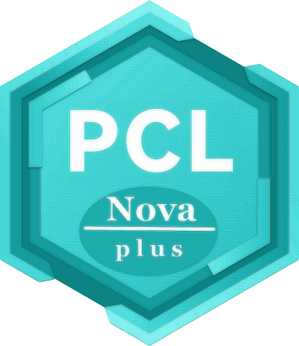

# PCL II Nova App

下一代 PCL 启动器，基于官方版 PCL2 的完全重构，采用 Web 技术和超高速并发的 Go 全新构建，这，就是 PCL II: Nova Plus！

第一个可用（功能有限）发行版计划于 2026.7 之前推出，在此之前你可以自行下载代码编译运行，请确保安装 Node 21+ 和 GoLang
你可以参阅[该网址](https://wails.io/docs/gettingstarted/installation)初始化项目，随后构建~

目前，本项目有以下须知需要你查阅：


1. 目前，本项目由[@FireDragon0659](https://github.com/FireDragon0659)和[@xphost008](https://github.com/xphost008)合作进行开发和维护，你可以随时随地查看本项目更新日志：[Changelog](./CHANGELOG.md)
2. 如果你使用的操作系统与作者的一样，是Windows系统！那么恭喜你，你可以直接从[蓝奏云](https://wwdy.lanzoub.com/b0sxw1u2h)，密码:aix5
3. 如果你的系统是类似于MacOS或者Linux的话，请试图从Actions当中下载可用的二进制文件。。
4. 欢迎随时随地收看来自老作者**MoYuan-CN**的新项目[NovaCL](https://github.com/NEXORA-Studios/NovaCL)！！
5. 如果你还不认识这位新作者的话，你随时可以参阅[作者的博客](https://xphost008.github.io)。
6. 在下载时，请务必查阅一次我们的[合作者/贡献者](./CONTRIBUTION.md)名单，并对我们的原作者以及原贡献者进行深深的敬意！！
7. 小万泥有点害羞哈~它还没有博客可以放出来。。

## 介绍一下NovaPlus的优势~

1. 目前本仓库没有使用到任何一个**第三方库**，有且仅使用到```Svelte```、```TypeScript```。没有使用```scss```、```router```这些繁琐的东西，将最原始且最快速的方式展现给各位！
2. 为什么使用Svelte而不是使用Vue呢？很简单！因为要减小代码体积！原因如下：
   1. 众所周知，使用```React```、```Vue```、```Angular```这类前端库写出来的项目非常大，有些使用router、pinia的项目甚至代码量达到了10MB甚至往上。而那些使用这些库的前端网页打开起来特别慢。
   2. 即使是某些后端应用，在使用上述几种库时，都几乎会使得生成的exe体积非常巨大。例如**BakaXL4**（使用```Vue```+```TypeScript```+```Tauri```）写的后端应用程序。
3. 总之，本软件将尽可能的压缩自身体积，在使用```UPX```进行压缩之后，也能达到非常小，小到不足5MB的应用程序。
4. ```PCL Nova Plus```的优势就在于：
   1. 打开比```Nova```快速
   2. 体积比```Nova```小
   3. 打包比```Nova```简单
   4. 部署比```Nova```容易
   5. 注释比```Nova```全面
